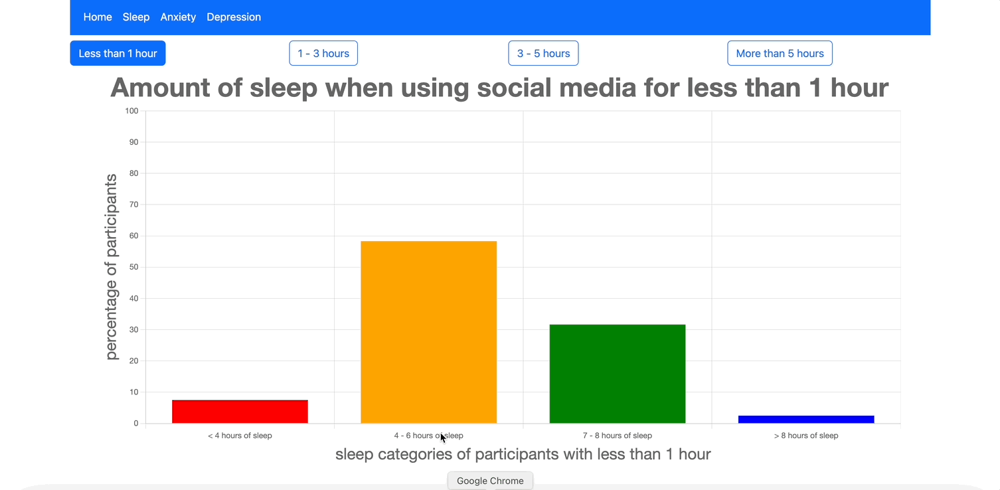

# Honors Contract - Graphical Representation of the relationship between amount of sleep, anxiety, depression and social media ue based on a dataset from ELSEVIER 
https://www.sciencedirect.com/science/article/pii/S2352340921008684#ecom0001

# description

### what the app does

The app offers 3 main pages. Each page plays explores the relationship between amount of social media usage, and a health pattern (such as sleep, anxiety, or depression) 

- Home:
    This pages provides the title along with instructions on how to use the 3 other pages
- Sleep:
    - This page profides a bar graph which represents the relationship between time spent on social media, and amount of sleep.
    - the x-axis represents the amount of sleep that the participants of the study recieved
    - The y-axis represents participants who recieved x amount of sleep
    - There are 4 buttons at the top of the page which represent different social media usage categories
    - when users click those buttons, it filters the participant to only those whose social medius usage patterns matches the selected cateogry
- Anxiety:
    - This page profides a bar graph which represents the relationship between time spent on social media, and amount of anxiety.
    - the x-axis represents the amount of anxiety that the participants of the study recieved
    - The y-axis represents participants who recieved x amount of anxiety
    - There are 4 buttons at the top of the page which represent different social media usage categories
    - when users click those buttons, it filters the participant to only those whose social media usage patterns matches the selected cateogry
- Depression:
    - This page profides a bar graph which represents the relationship between time spent on social media, and amount of depression.
    - the x-axis represents the amount of depression that the participants of the study recieved
    - The y-axis represents participants who recieved x amount of sleep
    - There are 4 buttons at the top of the page which represent different social media usage categories
    - when users click those buttons, it filters the participant to only those whose social medius usage patterns matches the selected cateogry

### Technologies used

- VueJS
- Bootstrap
- ChartJS
    - ChartJS is the JavaScript Charting Library that I used to plot the bar chart on each of the 3 main pages


# To get started with this app:

## Recommended IDE Setup

[VSCode](https://code.visualstudio.com/) + [Volar](https://marketplace.visualstudio.com/items?itemName=Vue.volar) (and disable Vetur) + [TypeScript Vue Plugin (Volar)](https://marketplace.visualstudio.com/items?itemName=Vue.vscode-typescript-vue-plugin).

## Customize configuration

See [Vite Configuration Reference](https://vitejs.dev/config/).

## Project Setup

```sh
npm install
```

### Compile and Hot-Reload for Development

```sh
npm run dev
```

### Compile and Minify for Production

```sh
npm run build
```

# how to use the project
### Limiations
as a student, the availabily of free, open-source datasets concerning health information are very limited. Thus, since the only dataset that I could find on the topic was from 2021 in Bangladesh, the relavancy of this particular site is limited...
### However...
If developers working in the health field were to have access to a dataset more relevant to their area along with the necessary permissions, forking this repository and adjusting the code to work their data and presenting the updated site to clients could serve them well

